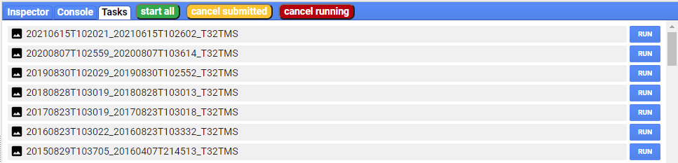

# ee-task-start

this user script adds three buttons to the google earthengine UI. It is based on the free version of [gee_monkey](https://github.com/gee-hydro/gee_monkey) by [gee-hydro](https://github.com/gee-hydro), licensed under MIT [included here](https://github.com/theendlessriver13/ee-task-start/blob/master/LICENSE_gee_monkey)

- `start all`: will start all created tasks in the Tasks tab
- `cancel submitted`: will cancel all submitted tasks where processing has not started yet
- `cancel running`: will cancel all running tasks, but not the ones submitted

## setup

the script was so far only tested with [Tampermonkey](https://chrome.google.com/webstore/detail/tampermonkey/dhdgffkkebhmkfjojejmpbldmpobfkfo?hl=de) with google chrome

- click on the Tampermonkey extension icon and select `create new userscript`
- paste the contents of `ee_task-start.js` into the editor
- you are good to go and the buttons should now come up on every page load unless you disable the user script
