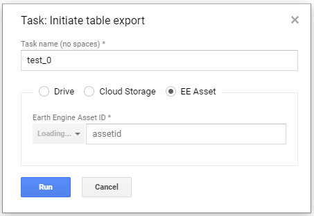

# ee-task-start

**earth engine now has a [task manager](https://developers.google.com/earth-engine/changelog#code_editor) so this will be unmaintained**

this user script adds three buttons to the google earthengine UI. It is based on the free version of [gee_monkey](https://github.com/gee-hydro/gee_monkey) by [gee-hydro](https://github.com/gee-hydro), licensed under MIT [included here](https://github.com/theendlessriver13/ee-task-start/blob/master/LICENSE_gee_monkey)

- `start all`: will start all created tasks in the Tasks tab
- `cancel submitted`: will cancel all submitted tasks where processing has not started yet
- `cancel running`: will cancel all running tasks, but not the ones submitted

## export to assets

- starting and an assets export is more complicated than starting an export to google drive, because earthengine checks for each task if the `asset_id` is valid and not already exists. This takes some time for each task (the longer the more tasks), because of that we need to wait for the `asset_id` field to be populated. You will see the dialog field indicating _loading_ for several seconds depending on the number of tasks.

## large number of tasks

- The background might get white when starting many tasks, this is because each popup window has a slightly blurry background which add up for each layer. It might look like it is not doing anything, but all the other popup dialogs are hidden under the one on top, which might be processed/started last. Especially for assets it might take several seconds (for 40 assets ~30 seconds) until all tasks are started.
- This tool is only good for a handful of tasks ~20. If you have more than this, you should think about your software design (e.g. don't export single band Images, but create multi band Images, flatten FeatureCollections etc.) or use the Python API instead.
- Cancelling large numbers of tasks might also not work on the first click, because the earthengine UI has not catched up yet. It may also look like all tasks were cancelled but after a second the are back to being active. Since the operation made my this user script are asynchronous and therefore fast, the earthengine UI has trouble handling this when there are too many tasks.

## setup

the script was so far only tested with [Tampermonkey](https://chrome.google.com/webstore/detail/tampermonkey/dhdgffkkebhmkfjojejmpbldmpobfkfo?hl=de) with google chrome

- click on the Tampermonkey extension icon and select `create new userscript`
- paste the contents of `ee_task-start.js` into the editor
- you are good to go and the buttons should now come up on every page load unless you disable the user script
